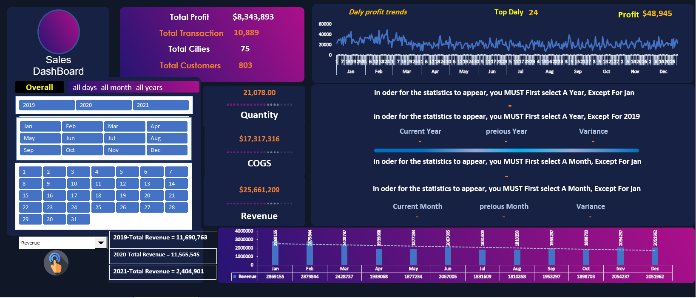
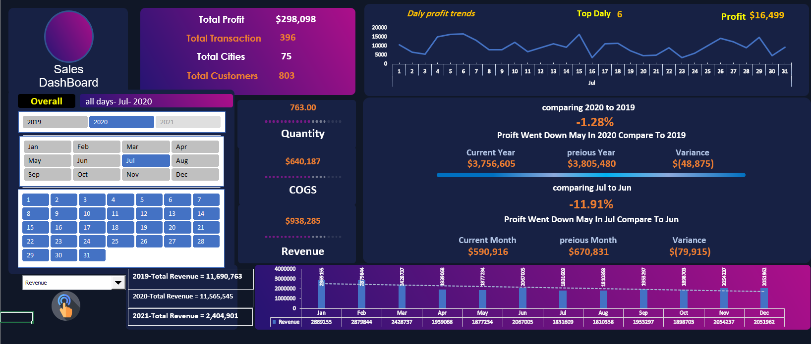

# 📊 تحليل المبيعات المتقدم - Dashboard تفاعلي باستخدام Excel

## نظرة عامة
مشروع تحليل مبيعات متكامل ومتقدم باستخدام Excel، يقدم تحليلاً شاملاً لأداء المبيعات والأرباح مع إمكانية المقارنة بين السنوات والأشهر والأيام. يتميز بواجهة تفاعلية غنية بالمؤشرات والرسوم البيانية الديناميكية.

## الهدف من المشروع
- تحليل شامل للمبيعات والأرباح على مستوى السنوات والأشهر والأيام
- مقارنة الأداء بين السنوات المختلفة (2019، 2020، 2021)
- حساب الفروق والنسب المئوية بين الفترات (Variance Analysis)
- تحليل اتجاهات الأرباح اليومية (Daily Profit Trends)
- متابعة مؤشرات الأداء الرئيسية بشكل لحظي
- توفير رؤى استراتيجية لتحسين الأداء المالي

## المميزات والتفاعلات

### 🎯 مؤشرات الأداء الرئيسية
- **إجمالي الأرباح**: $8,343,893
- **إجمالي المعاملات**: 10,889
- **عدد المدن**: 75
- **عدد العملاء**: 803
- **أعلى ربح يومي**: $48,945

### 📊 المقارنات الزمنية
- **مقارنة سنوية**: تحليل أداء 2019، 2020، 2021
- **مقارنة شهرية**: Current Month vs Previous Month
- **مقارنة يومية**: تحليل تفصيلي للأيام
- **نسب الفروق**: Variance % مع إشارة للاتجاه (up/down)

### 📈 الرسوم البيانية
- **إيرادات السنوات**: مقارنة إجمالي الإيرادات لكل سنة
- **اتجاهات الأرباح اليومية**: Daily Profit Trends
- **توزيع الإيرادات الشهرية**: تحليل تفصيلي لكل شهر
- **مخططات تفاعلية**: تتغير حسب التصفية

### 🔍 أدوات التصفية (Slicers)
- **تصفية حسب السنة**: 2019، 2020، 2021
- **تصفية حسب الشهر**: January - December
- **تصفية حسب اليوم**: 1 - 31
- **تصفية شاملة**: all days - all months - all years

## التقنيات والأدوات المستخدمة

### 1. **الدوال المتقدمة**
```excel
// دوال التنظيف والمعالجة
=TRIM(), =CLEAN(), =SUBSTITUTE(), =IFERROR()

// دوال البحث والمرجع
=VLOOKUP(), =INDEX(MATCH()), =XLOOKUP()

// دوال إحصائية شرطية
=SUMIFS(), =COUNTIFS(), =AVERAGEIFS()

// دوال منطقية
=IF(), =AND(), =OR(), =IFS()
```

### 2. **الجداول المحورية (PivotTables)**
- إنشاء تقارير ديناميكية
- تجميع البيانات حسب الفترات الزمنية
- حسابات النسب المئوية
- الحقول المحسوبة

### 3. **وحدات الماكرو (VBA)**
- أتمتة عمليات التحديث
- تنسيق تلقائي للتقارير
- تصدير البيانات
- تحديث الاتصالات

### 4. **التنسيق الشرطي (Conditional Formatting)**
- إبراز أعلى/أقل القيم
- تلوين الفروق (إيجابي/سلبي)
- أشرطة البيانات (Data Bars)
- مجموعات الألوان (Color Scales)

### 5. **السلايسر (Slicers)**
- تصفية تفاعلية
- تنسيق مخصص
- اتصال متعدد بالجداول المحورية
- تقويم زمني ديناميكي

## تحليل الفروق (Variance Analysis)

### مقارنة سنوية
| المؤشر | 2019 | 2020 | 2021 |
|--------|------|------|------|
| إجمالي الإيرادات | $11,690,763 | $11,565,545 | $2,404,901 |
| الفرق | - | $(125,218) | $(9,285,862) |
| نسبة التغير | - | -1.07% | -79.42% |

### مقارنة شهرية (مثال: مايو 2020 مقابل 2019)
- **Current Year (2020)**: $3,756,605
- **Previous Year (2019)**: $3,805,480
- **Variance**: $(48,875)
- **Percentage**: -1.28%
- **Trend**: 📉 Down

## أبرز الرؤى والنتائج
- انخفاض في الأرباح خلال مايو 2020 مقارنة بـ 2019 بنسبة 1.28%
- عام 2021 شهد انخفاضاً كبيراً في الإيرادات (البيانات وهمية لأغراض التدريب)
- أعلى ربح يومي مسجل: $48,945
- إجمالي المعاملات يتجاوز 10 آلاف عملية
- تغطية 75 مدينة مختلفة

## معاينة المشروع

*صورة 1: نظرة عامة على Dashboard الرئيسي مع المؤشرات*


*صورة 2: تفاصيل التحليل والمقارنات*

## كيفية استخدام Dashboard

### الخطوة 1: تمكين الماكرو
عند فتح الملف لأول مرة:
1. اضغط على **Enable Content** لتمكين وحدات الماكرو
2. اسمح بتحديث الاتصالات إذا طُلب

### الخطوة 2: التصفية والتحليل
1. **اختر السنة** (إجباري للإحصائيات):
   - اختر من Slicer السنوات: 2019، 2020، 2021
   - ملاحظة: استثناء لشهر يناير (يحتاج اختيار سنة)

2. **اختر الشهر** (اختياري):
   - استخدم Slicer الشهور
   - ملاحظة: بعض الإحصائيات تحتاج اختيار شهر

3. **اختر اليوم** (اختياري):
   - تصفية حسب اليوم من 1-31

### الخطوة 3: قراءة النتائج
- شاهد التحديث الفوري لجميع المؤشرات
- تابع نسبة الفرق بين الفترات
- حلل اتجاهات الأرباح اليومية
- قارن أداء السنوات في رسم الإيرادات

## المهارات المعروضة في هذا المشروع

### ✅ مهارات Excel متقدمة
- **الدوال المتقدمة**: مجموعة واسعة من دوال Excel
- **الجداول المحورية**: تصميم وتحليل متقدم
- **وحدات الماكرو VBA**: أتمتة العمليات
- **التنسيق الشرطي**: إبراز البيانات بشكل ذكي
- **السلايسر**: تصفية تفاعلية متقدمة

### ✅ مهارات تحليل البيانات
- تحليل الفروق (Variance Analysis)
- المقارنات الزمنية (Time Intelligence)
- تحليل الاتجاهات (Trend Analysis)
- مؤشرات الأداء الرئيسية (KPIs)

### ✅ مهارات تقنية
- تصميم واجهات المستخدم
- التفاعلية والديناميكية
- معالجة البيانات وتنظيفها
- أتمتة التقارير

## هيكل المشروع
```
salce_DashBoard_Excel/
│
├── Muwafaq_Alkmali_Analysis_Salce.xlsm
├── README.md
│
└── images/
    ├── Dashboardmain.png
    └── Dashboardsub.png
```

## تحميل المشروع
- 📥 [ملف Excel مع وحدات الماكرو](Muwafaq_Alkmali_Analysis_Salce.xlsm)
- 📂 [معاينة الصور](images/)

## ملاحظات مهمة
⚠️ **تمكين الماكرو**: يجب تمكين المحتوى (Enable Content) عند فتح الملف
⚠️ **بيانات وهمية**: جميع البيانات المستخدمة هي لأغراض التدريب فقط
⚠️ **ترتيب التصفية**: بعض الإحصائيات تحتاج تحديد سنة/شهر أولاً

## التطوير المستقبلي
- إضافة المزيد من التحليلات التنبؤية
- دمج Power Query لاستيراد بيانات خارجية
- إنشاء تقارير PDF تلقائية
- إضافة Dashboard للهواتف المحمولة

## تواصل معي


- البريد الإلكتروني: [muwaffaqalkmaly@gmail.com]

## شكر وتقدير
شكراً لاهتمامك بهذا المشروع المتكامل. إذا أعجبك، لا تنسى وضع ⭐ على المستودع. وأي استفسار أو اقتراح مرحب به! 😊
